<p align="center">
  <h1 align="center">💰 FinanceAll</h1>
  <p align="center">
    <strong>Platform Manajemen Keuangan Pribadi Terintegrasi</strong>
  </p>
  <p align="center">
    
    
    
    
    
  </p>
</p>

---

## 📋 Tentang Project

**FinanceAll** adalah sistem manajemen keuangan pribadi berbasis web yang dibangun menggunakan **Java Spring Boot**. Aplikasi ini membantu pengguna mencatat pemasukan & pengeluaran, mengelola hutang, membangun dana darurat, menghitung target Financial Independence (FI), serta melacak progress level gamifikasi keuangan.

### ✨ Fitur Utama

| Fitur | Deskripsi |
|-------|-----------|
| 📊 **Dashboard** | Ringkasan finansial lengkap: saldo, cashflow, dan transaksi terakhir |
| 💸 **Transaksi** | Catat pemasukan & pengeluaran dengan kategori dan tanggal |
| 💳 **Dompet** | Pantau likuiditas, saldo, dan arus kas bulanan |
| 📉 **Manajemen Hutang** | Lacak dan lunasi kewajiban secara terstruktur |
| 🛡️ **Dana Darurat** | Bangun jaring pengaman finansial dengan target & progress |
| 🚀 **FI Calculator** | Kalkulasi target Financial Independence (aturan 4%) |
| 🎮 **Level & Gamifikasi** | Level up berdasarkan konsistensi pencatatan keuangan |
| 👤 **Profil** | Kelola data pribadi dan keamanan akun |
| 🔐 **Recovery PIN** | Reset password tanpa email menggunakan PIN 6 digit |
| 🛠️ **Admin Panel** | Dashboard admin, manajemen user, artikel, level, dan activity logs |

---

## 📸 Screenshots

### Autentikasi

<table>
  <tr>
    <td align="center"><strong>Login</strong></td>
    <td align="center"><strong>Register</strong></td>
  </tr>
  <tr>
    <td>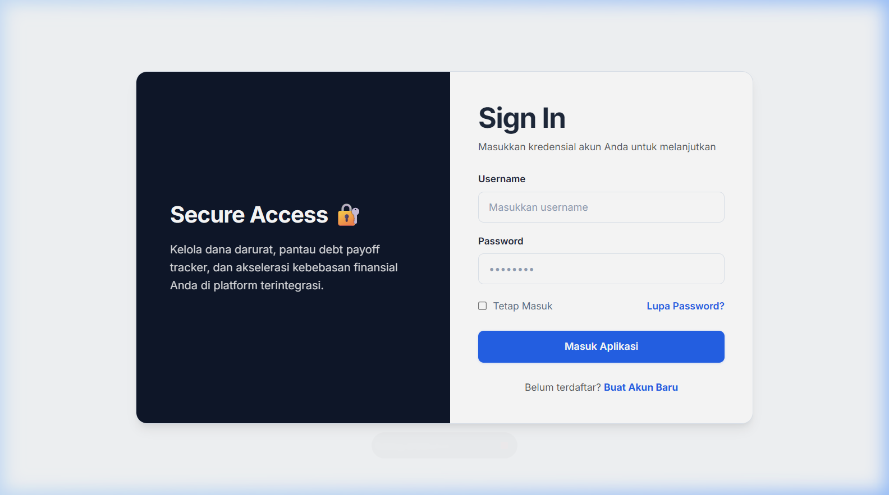</td>
    <td>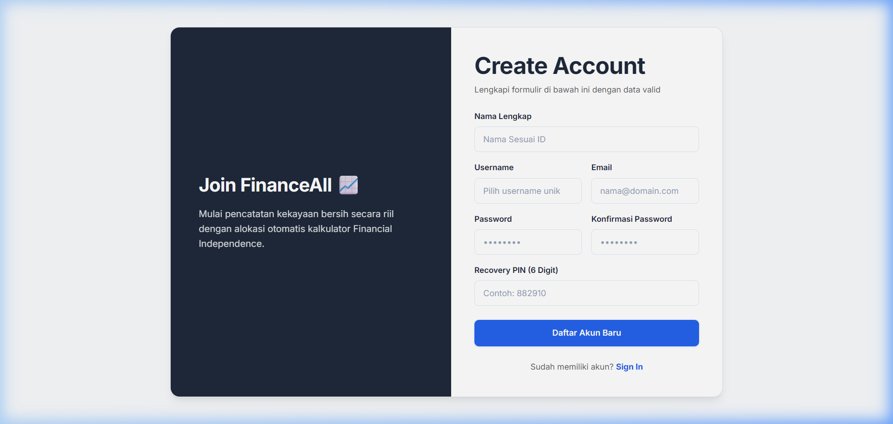</td>
  </tr>
</table>

### Panel User

<table>
  <tr>
    <td align="center"><strong>Dashboard</strong></td>
    <td align="center"><strong>Transaksi</strong></td>
  </tr>
  <tr>
    <td>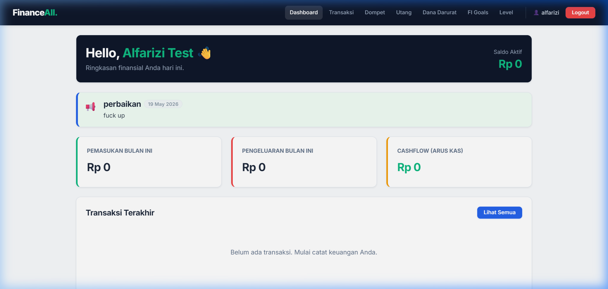</td>
    <td>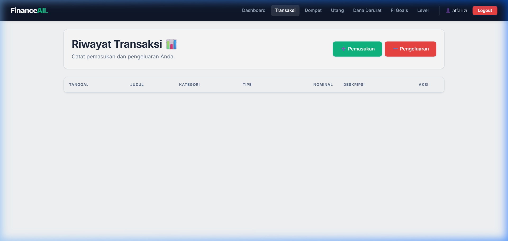</td>
  </tr>
  <tr>
    <td align="center"><strong>Dompet</strong></td>
    <td align="center"><strong>Manajemen Hutang</strong></td>
  </tr>
  <tr>
    <td>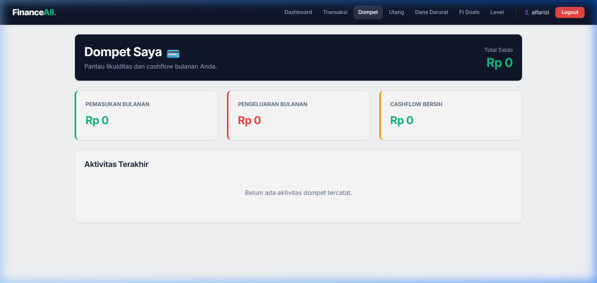</td>
    <td>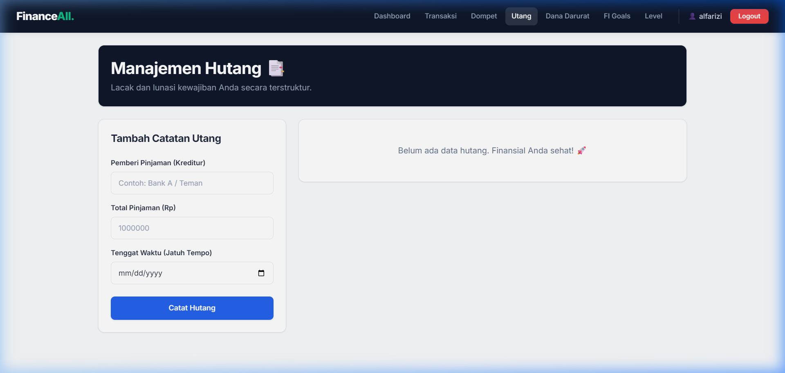</td>
  </tr>
  <tr>
    <td align="center"><strong>Dana Darurat</strong></td>
    <td align="center"><strong>FI Calculator</strong></td>
  </tr>
  <tr>
    <td>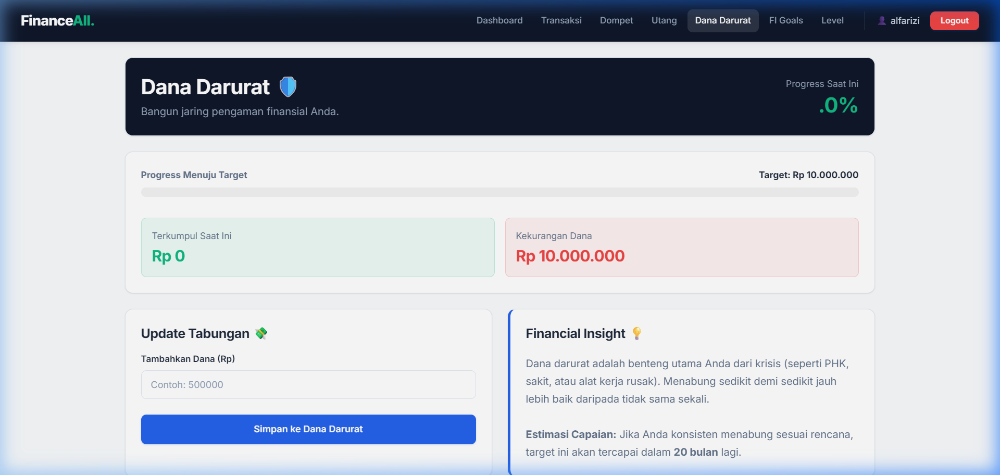</td>
    <td>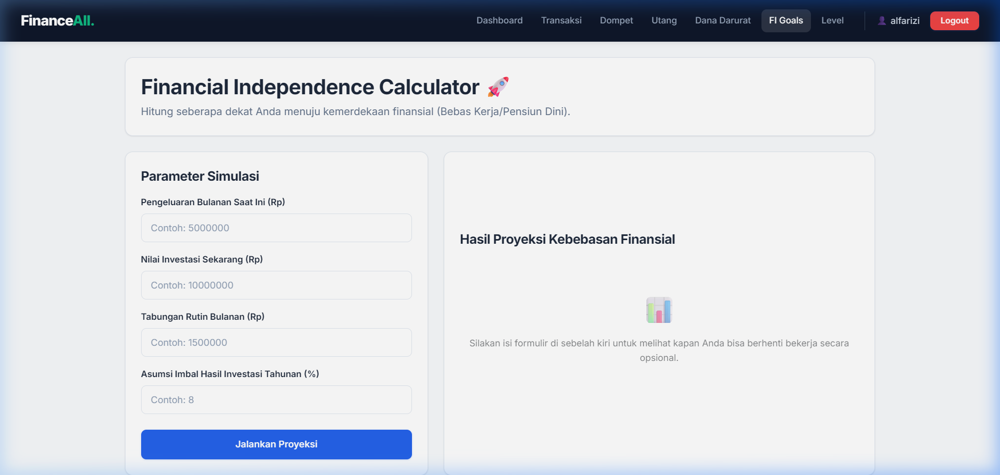</td>
  </tr>
  <tr>
    <td align="center"><strong>Level & Gamifikasi</strong></td>
    <td align="center"><strong>Profil</strong></td>
  </tr>
  <tr>
    <td>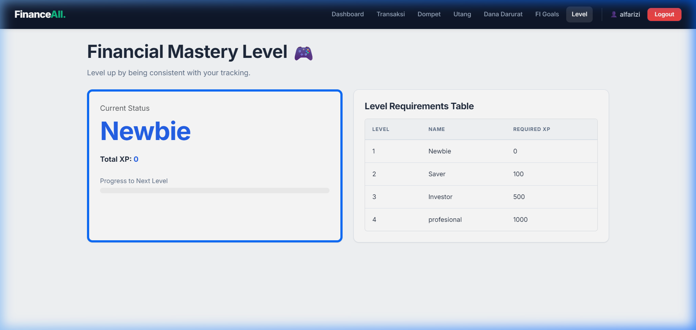</td>
    <td>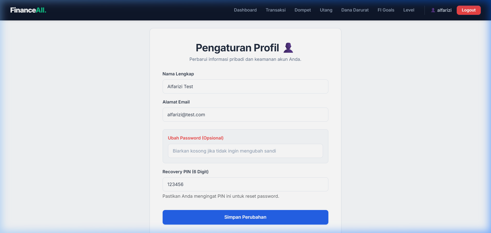</td>
  </tr>
</table>

### Panel Admin

<table>
  <tr>
    <td align="center"><strong>Admin Dashboard</strong></td>
    <td align="center"><strong>User Management</strong></td>
  </tr>
  <tr>
    <td>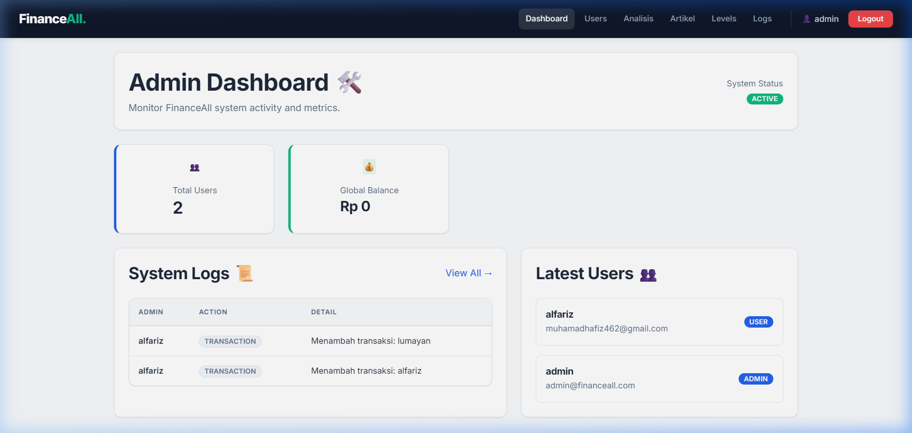</td>
    <td>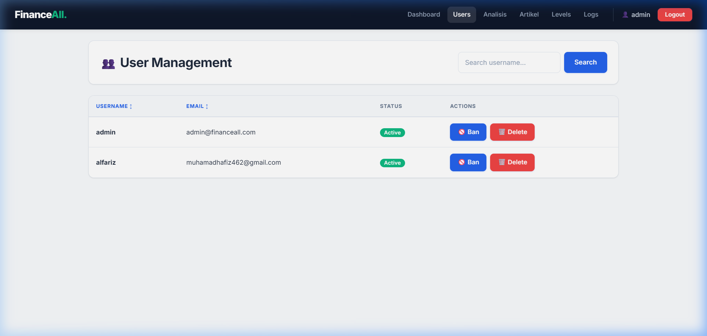</td>
  </tr>
  <tr>
    <td align="center"><strong>Artikel / Pengumuman</strong></td>
    <td align="center"><strong>Activity Logs</strong></td>
  </tr>
  <tr>
    <td>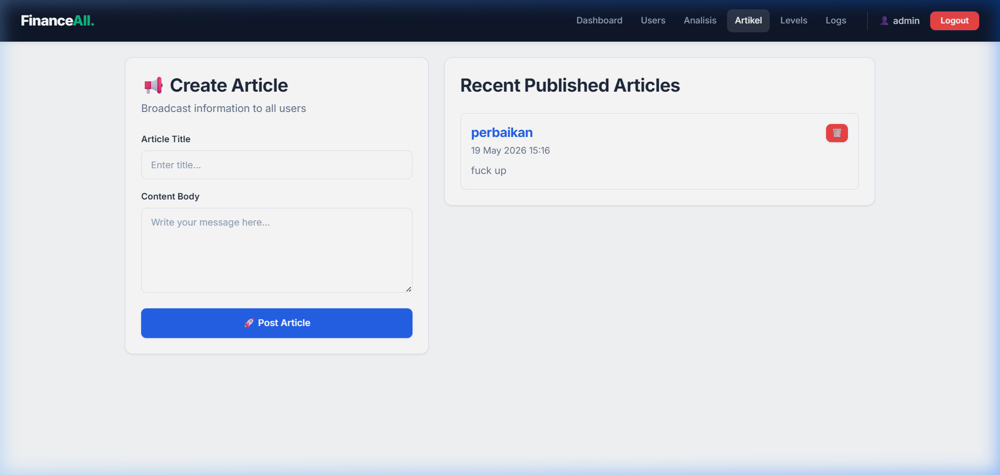</td>
    <td>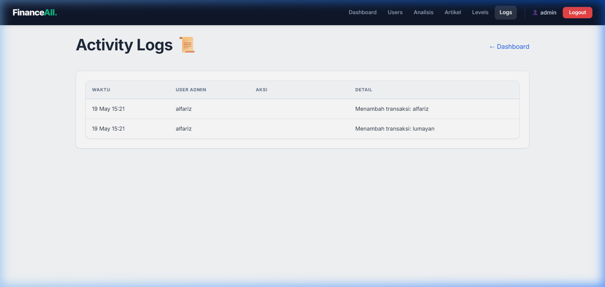</td>
  </tr>
</table>

---

## 🛠️ Tech Stack

| Layer | Teknologi |
|-------|-----------|
| **Backend** | Java 17, Spring Boot 3.2.0, Spring Data JPA, Hibernate |
| **Frontend** | Thymeleaf, Bootstrap 5, Custom CSS (Inter Font) |
| **Database** | PostgreSQL 16 |
| **Security** | BCrypt Password Encoder, Session-based Auth, Recovery PIN |
| **Build Tool** | Apache Maven |

---

## 🚀 Cara Menjalankan

Skema database dikelola otomatis oleh **Flyway** (`src/main/resources/db/migration/V1__init_schema.sql`).
Tabel dibuat saat aplikasi pertama kali start — tidak perlu load SQL manual.

### Opsi A — Docker (direkomendasikan) 🐳

Prasyarat: **Docker** & **Docker Compose**.

```bash
# 1. Siapkan environment
cp .env.example .env
#    lalu edit .env: isi POSTGRES_PASSWORD, APP_ADMIN_PASSWORD, APP_ADMIN_RECOVERY_PIN

# 2. Build & jalankan (app + PostgreSQL)
docker compose up -d --build

# 3. Cek kesehatan
curl http://localhost:8080/actuator/health   # {"status":"UP"}
```

Akses aplikasi di `http://localhost:8080`. Hentikan dengan `docker compose down`
(tambah `-v` untuk menghapus data database).

### Opsi B — Lokal (Maven)

Prasyarat: **Java 17+**, **PostgreSQL** berjalan.

```bash
# Buat database
createdb financeall

# Set kredensial via environment (jangan hardcode!)
export SPRING_DATASOURCE_URL=jdbc:postgresql://localhost:5432/financeall
export SPRING_DATASOURCE_USERNAME=postgres
export SPRING_DATASOURCE_PASSWORD=your_password
export SPRING_PROFILES_ACTIVE=dev

# Jalankan
./mvnw spring-boot:run      # Windows: .\mvnw.cmd spring-boot:run
```

### Konfigurasi (Environment Variables)

| Variable | Wajib | Default | Keterangan |
|----------|:-----:|---------|-----------|
| `SPRING_DATASOURCE_URL` | ✅ | — | JDBC URL PostgreSQL |
| `SPRING_DATASOURCE_USERNAME` | ✅ | — | Username database |
| `SPRING_DATASOURCE_PASSWORD` | ✅ | — | Password database |
| `SPRING_PROFILES_ACTIVE` | — | `prod` | `prod` atau `dev` |
| `APP_ADMIN_PASSWORD` | — | `admin123` | Password admin yang di-seed (first run) |
| `APP_ADMIN_RECOVERY_PIN` | — | `123456` | Recovery PIN admin (first run) |
| `PORT` | — | `8080` | Port HTTP |

### Default Admin Account

Di-seed otomatis saat pertama kali start (gunakan `APP_ADMIN_PASSWORD` /
`APP_ADMIN_RECOVERY_PIN` untuk meng-override nilai default di bawah).

| Field | Default |
|-------|---------|
| Username | `admin` |
| Password | `admin123` ⚠️ **ganti di production** |
| Recovery PIN | `123456` ⚠️ **ganti di production** |

---

## 📁 Struktur Project

```
financeall/
├── src/main/java/com/financeall/
│   ├── config/              # Konfigurasi (Auth, WebConfig, DataSeeder)
│   ├── controller/          # REST & MVC Controllers
│   ├── dto/                 # Data Transfer Objects
│   ├── model/               # JPA Entities
│   ├── repository/          # Spring Data JPA Repositories
│   └── service/             # Business Logic Layer
├── src/main/resources/
│   ├── static/css/          # Custom CSS (style.css)
│   ├── templates/           # Thymeleaf HTML Templates
│   │   ├── admin/           # Admin pages
│   │   ├── auth/            # Login, Register, Reset Password
│   │   ├── fragments/       # Header & Footer fragments
│   │   └── user/            # User pages
│   ├── application.properties
│   └── application-dev.properties
├── docs/screenshots/        # Screenshot dokumentasi
├── pom.xml                  # Maven dependencies
└── README.md
```

---

## 🔒 Fitur Keamanan

- **Password Hashing** — Semua password di-hash menggunakan BCrypt
- **Session-based Authentication** — Login state dikelola via HttpSession
- **Auth Interceptor** — Proteksi route `/user/**` dan `/admin/**`
- **IDOR Prevention** — Validasi kepemilikan data sebelum edit/hapus
- **Recovery PIN** — Reset password tanpa email, menggunakan PIN 6 digit
- **Ban System** — Admin dapat menonaktifkan akun pengguna
- **Role-based Access** — Pemisahan akses antara User dan Admin

---

## 📊 Arsitektur

```
┌─────────────┐     ┌──────────────┐     ┌──────────────┐
│   Browser   │────▶│  Controller  │────▶│   Service    │
│ (Thymeleaf) │◀────│   (MVC)      │◀────│   (Logic)    │
└─────────────┘     └──────────────┘     └──────┬───────┘
                                                 │
                    ┌──────────────┐     ┌───────▼───────┐
                    │  PostgreSQL  │◀────│  Repository   │
                    │  (Database)  │────▶│   (JPA)       │
                    └──────────────┘     └───────────────┘
```

---

## 👨‍💻 Author

**Alfarizi** — [GitHub](https://github.com/a1fariz)

---

## 📄 License

This project is licensed under the MIT License.